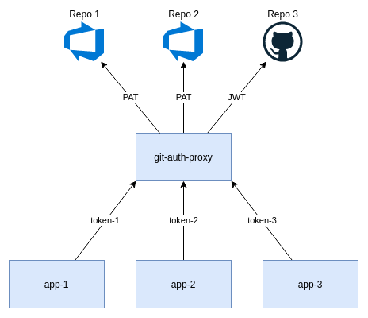

# Azure DevOps Proxy

[](https://goreportcard.com/report/github.com/XenitAB/azdo-proxy)
[](https://quay.io/repository/xenitab/azdo-proxy)

Proxy to allow sharing of a Azure DevOps Personal Access Token in a Kubernetes cluster.

Azure DevOps allows the use of Personal Access Tokens (PAT) to authenticate access to both its
API and Git repositories. Sadly it does not provide an API to create new PAT, making the process
of automation cumbersome if multiple tokens are needed with limited scopes.

<p align="center">
  
</p>

Azure DevOps Proxy (azdo-proxy) is an attempt to solve this issue by enabling a single PAT
to be shared by many applications, while at the same time limiting access for each application.
Tokens are generated automatically and written as a Kubernetes secrets to one or multiple namespaces,
the application just needs to mount the secret and use it when communicating with the proxy.
Requests are sent to azdo-proxy together with a token, which gives access to a specific repository.
The request is checked and if allowed forwarded to Azure DevOps with the PAT appended to the request.

## How To

Start off by [creating a new PAT](https://docs.microsoft.com/en-us/azure/devops/organizations/accounts/use-personal-access-tokens-to-authenticate?view=azure-devops&tabs=preview-page) as it has to be given to the proxy.

The proxy reads its configuration from a JSON file. The file will contain the PAT used to authenticate
requests with, the Azure DevOps organization, and a list of repositories that can be accessed through
the froxy from the specified namespaces.
```json
{
  "organizations": [
    {
      "name": "xenitab",
      "pat": "foobar",
      "repositories": [
        {
          "name": "fleet-infra",
          "project": "lab",
          "namespaces": [
            "foo",
            "bar"
          ]
        }
      ]
    }
  ]
}
```

Add the Helm repository and install the chart, be sure to set the config content.
```shell
helm repo add https://xenitab.github.io/azdo-proxy/
helm install azdo-proxy --set config=<config>
```

There should now be a azdo-proxy Pod and Service in the cluster, ready to proxy traffic.

### Git

Cloning a repository through the proxy is not too different from doing so directly from Azure DevOps.
The only limitation is that it is not possible to clone through ssh, as azdo-proxy only proxies HTTP traffic.
To clone the repository `repo-1` [get the clone URL from the repository page](https://docs.microsoft.com/en-us/azure/devops/repos/git/clone?view=azure-devops&tabs=visual-studio#get-the-clone-url-to-your-repo).
Then replace the host part of the URL with `azdo-proxy` and add the token as a basic auth parameter. The result should be similar to below.
```shell
git clone http://<token-1>@azdo-proxy/org/proj/_git/repo-1
```

### API

Authenticated API calls can also be done through the proxy. Currently only repository specific
requests will be permitted. This may change in future releases. As an example execute the
following command to list all pull requests in the repository `repo-1`.
```shell
curl http://<token-1>@azdo-proxy/org/proj/_apis/git/repositories/repo-1/pullrequests?api-version=5.1
```

> :warning: **If you intend on using a language specific API**: Please read this!

Some APIs built by Microsoft, like [azure-devops-go-api](https://github.com/microsoft/azure-devops-go-api), will make a request to the [Resource Areas API](https://docs.microsoft.com/en-us/azure/devops/extend/develop/work-with-urls?view=azure-devops&tabs=http#how-to-get-an-organizations-url)
which returns a list of location URLs for a specific organization. They will then use those URLs
when making additional requests, skipping the proxy. To avoid this you need to explicitly create
your client instead of allowing it to be created automatically.

In the case of Go you should create a client in the following way.
```golang
package main

import (
  "github.com/microsoft/azure-devops-go-api/azuredevops"
  "github.com/microsoft/azure-devops-go-api/azuredevops/git"
)

func main() {
  connection := azuredevops.NewAnonymousConnection("http://azdo-proxy")
  client := connection.GetClientByUrl("http://azdo-proxy")
  gitClient := &git.ClientImpl{
    Client: *client,
  }
}
```

Instead of the cleaner solution which would ignore the proxy.
```golang
package main

import (
  "context"

  "github.com/microsoft/azure-devops-go-api/azuredevops"
  "github.com/microsoft/azure-devops-go-api/azuredevops/git"
)

func main() {
  connection := azuredevops.NewAnonymousConnection("http://azdo-proxy")
  ctx := context.Background()
  gitClient, _ := git.NewClient(ctx, connection)
}
```

# License

This project is licensed under the MIT License - see the [LICENSE](LICENSE) file for details.

